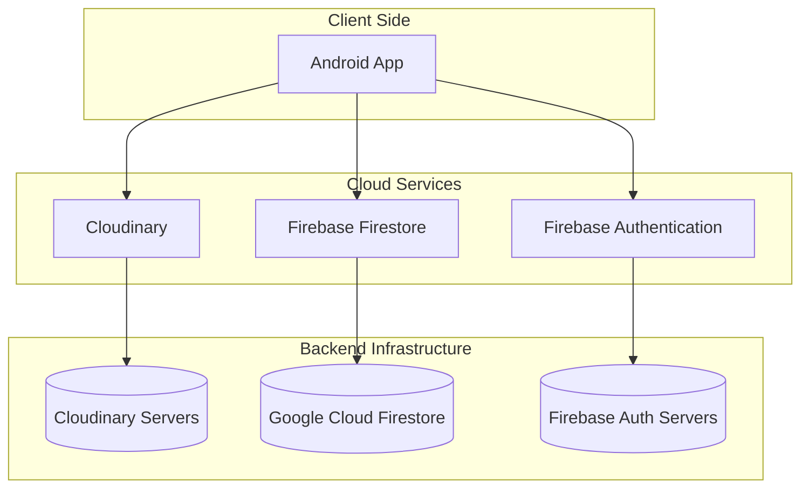
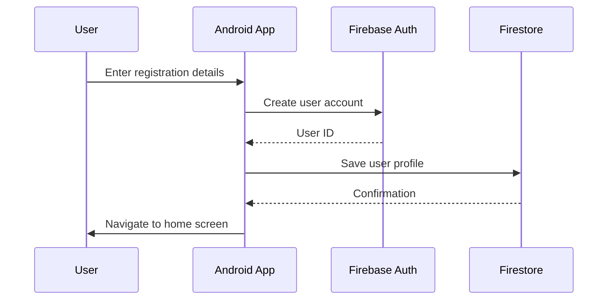
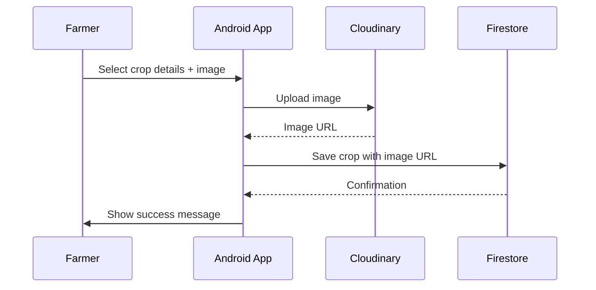
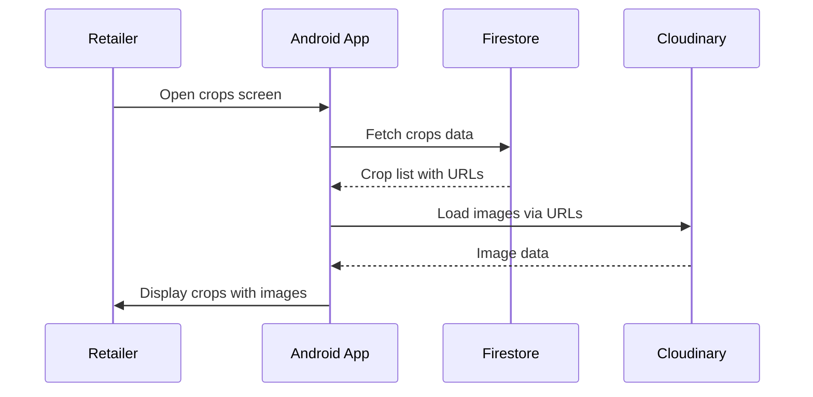

# Application Architecture

## Overview
The Farmers and Retailers Binding Platform follows a client-server architecture with cloud services for authentication, data storage, and image hosting.

## Component Details

### 1. Android Application
- **Framework**: Jetpack Compose with Material 3
- **Language**: Kotlin
- **Architecture**: MVVM (Model-View-ViewModel)
- **Navigation**: Jetpack Navigation Component

### 2. Firebase Integration
- **Authentication**: Email/password authentication
- **Database**: Cloud Firestore for structured data
- **Real-time**: Listeners for live data updates

### 3. Cloudinary Integration
- **Image Storage**: Cloud-based image hosting
- **Uploads**: Direct uploads from mobile device
- **Delivery**: CDN-backed image delivery
- **Transformations**: On-the-fly image processing

## Data Flow

### User Registration

### Crop Upload

### Crop Browsing

## Security Considerations

### Authentication
- Firebase Authentication handles user credentials securely
- Token-based authentication for API calls
- Role-based access control (Farmer vs Retailer)

### Data Protection
- Firestore security rules control data access
- HTTPS encryption for all network communications
- Cloudinary signed URLs for secure image access

### Image Security
- Private image uploads with access control
- Secure delivery through Cloudinary's CDN
- Image transformations to prevent malicious content

## Performance Optimization

### Caching
- Firestore offline persistence
- Image caching with Coil library
- Local data storage for frequently accessed information

### Network Efficiency
- Compressed image uploads
- Pagination for large data sets
- Lazy loading for images

### UI Responsiveness
- Asynchronous operations with Kotlin Coroutines
- Loading states for better UX
- Error handling and retry mechanisms